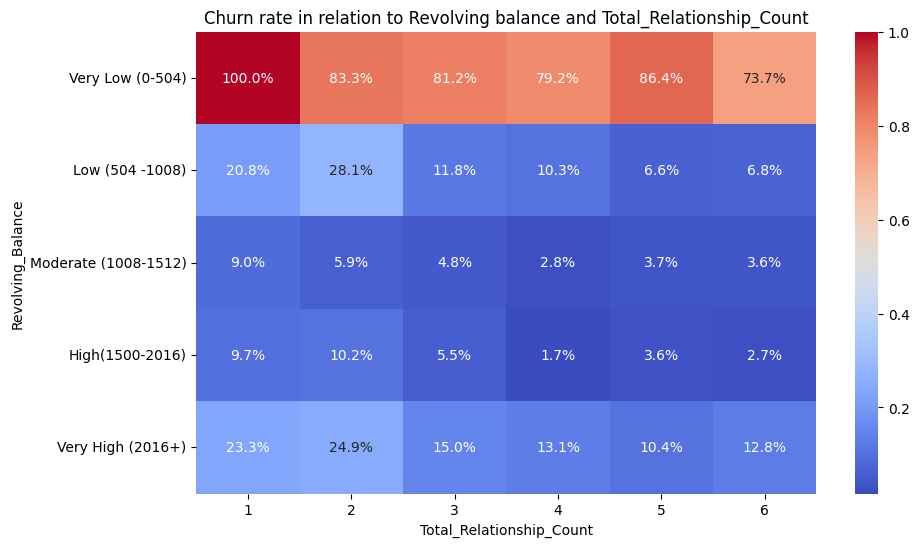
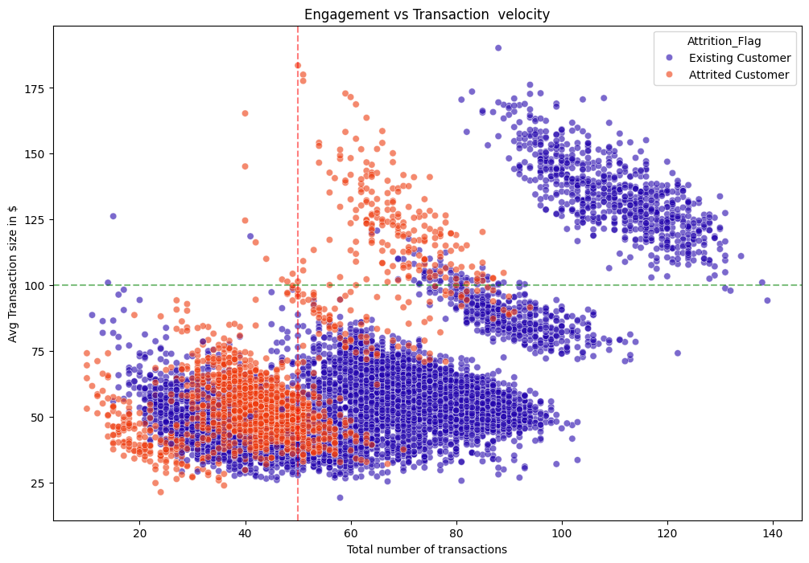
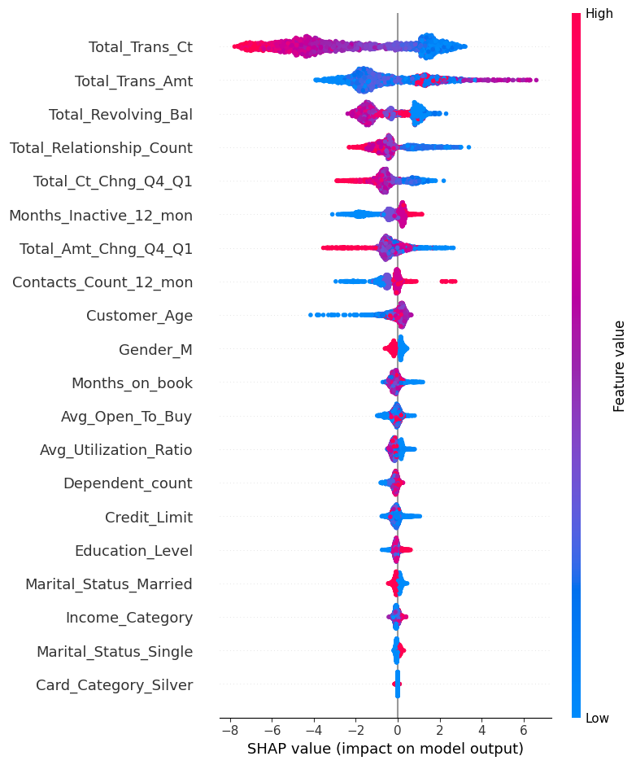
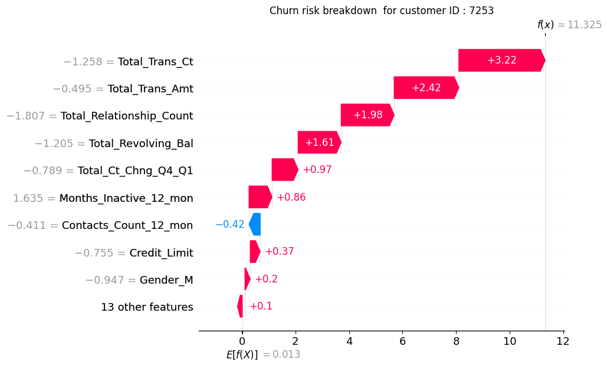

# Strategic Bank Attrition Analysis & Interpretability
## Executive Summary
This repository details an end-to-end analytical pipeline designed to  explain customer churn within retail banking environment. This project will priotize model transparency and actionable insights bt integrating hyperparameter tuning with tools like optuna and shapley addictive explanations (SHAP) for feature attribution.

## Business Problem and Solution
Problem: High customer turnover in the banking sector significantly increases customer acqusition  costs and erodes a frim long-term profitablity.

Solution: A robust tree based machine learning framework that identifies customers likely to leave and provides a localized explanations on why each customer is likely to leave.

## Technical Implemenations 
### Explanatory Data Discovery(EDA)
Comprehensive analysis was conducted to to validate churn indicators in the eda.ipynb. key findings:
Product synergy: Customers were likely to churn if their frequency at the bank was less than 60 and transaction sizes being less than $75. The customers with 1 transactions counts(bank products) od lower revolving balance of less than $504 had a 100% churning rate.

## Algorithymic Optimization 
To ensure peak performance on the imbalanced data, I utilized smote to creaate synthectic churners thus making the model not only to learn on majority classes(Existing customers) but also churning ones and then used tree-structured parzen estimator via optuna for parameter tuning:
Objective: Maximize fi-score to balance precision and recall.
Outcome: An automated 30-trial study converged on an optimal configuration for XGboost thus significantlly increasing its performance by utilizing optimized parameters. 

## Model Interpretability (SHAP)
I implemented shapley addictive explanations(SHAP) to decompose the model output to show the features that were the highest drivers of customer churn:
*Global Importance: The model udentified Total_transactions_ct, Total_revolving_balance, T0tal_relationship_count as primary drivers
*Local Explainability: Waterfall plot will provide a particular customer reasons for churning thus allowing for a personalized retention offers

## Installation and Usage:
*clone this repository 

*Navigate to directory
<pre> cd Bank Churn </pre>
*install dependencies 
<pre>pip install -r requirements.txt </pre>
*Run analysis: Execute ed.ipynb to reproduce EDA, Preprocessing.ipynb to view feature engineering on the dataset and modeeling.ipynb for training XGBoost model, Optuna and shap analysis
